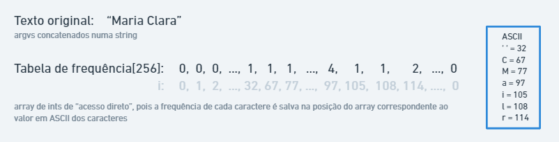
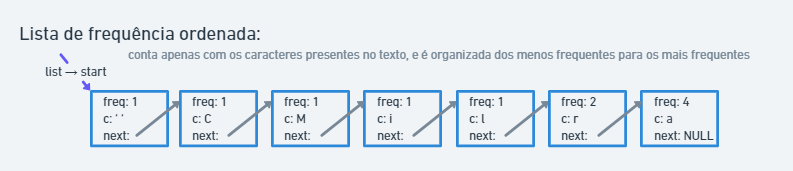
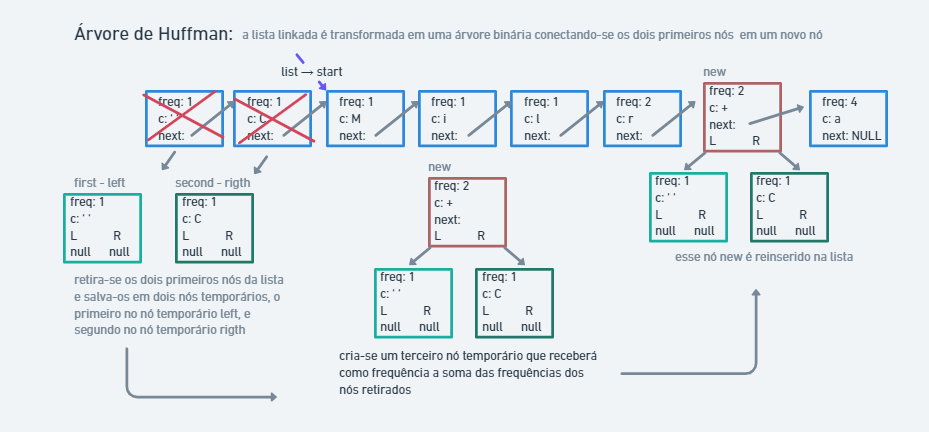
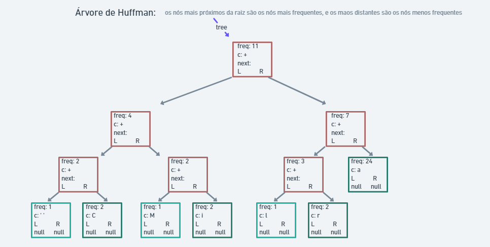
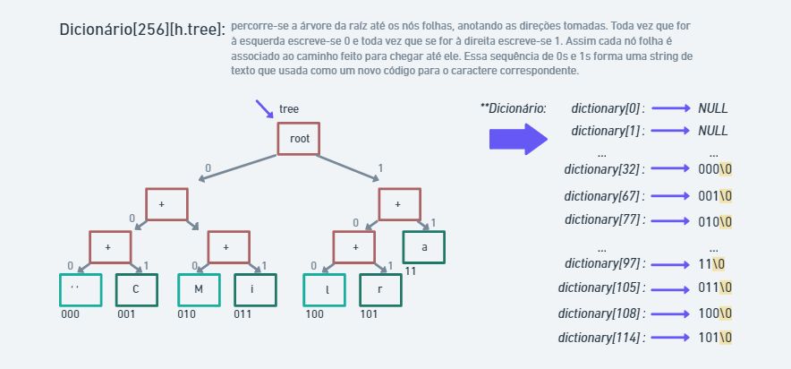
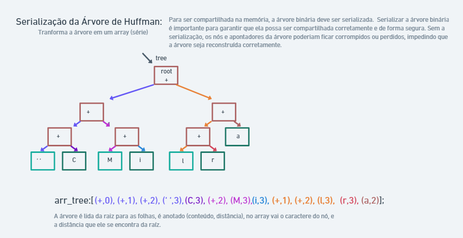
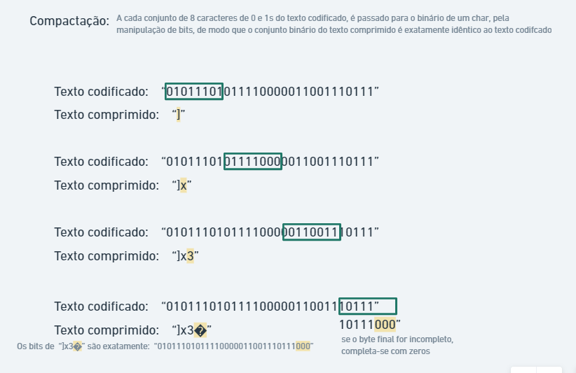
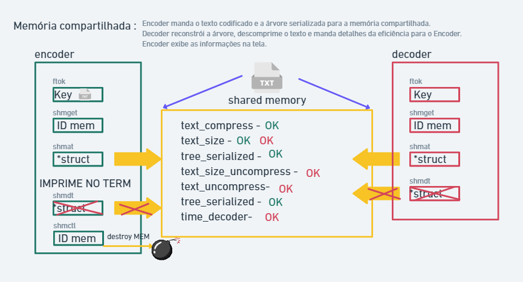
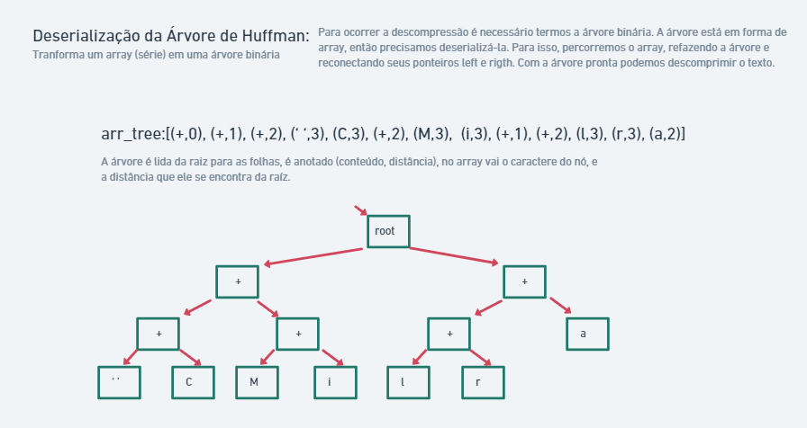
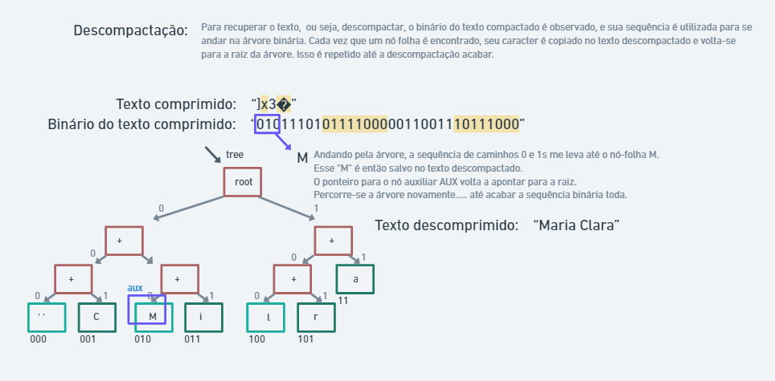

# Explicação Detalhada

### Encoder: 
 

#### Algoritmo de Compressão de Huffman

- *Tabela de Frequência* - Usa-se poucos bits para os caracteres mais frequentes e mais bits para os caracteres menos frequentes, de modo a otimizar o gasto de espaço. O peso de um caracter é a frequência com que ele aparece no texto. Os caracteres de maior peso, são mais frequentes e serão representados com menos bits, já os caracteres de menor peso, aparecem menos no texto e serão representados por um maior número de bits. 
Fazemos um vetor de inteiros do tamanho da ASCII estendida (256), assim temos uma tabela de "acesso direto", a posição da tabela que um caracter se encontra é o seu valor e, ASCII.

- *Lista Encadeada Ordenada*- Cria-se uma lista seguindo a ordem das frequências dos caracteres, dos menos utilizados (início da lista) para os mais utilizados (no fim da lista).

- *Árvore de Huffman* - Uma árvore binária com os elementos presentes na lista encadeada ordenada. A árvore é montada seguindo a ordem crescente de frequência, de modo que, de dois em dois, os elementos de menor frequência são retirados, unidos por um novo nó, e a frequência desse novo nó passa a ser a soma das frequências dos dois antigos nós retirados. Esse novo nó é recolocado na Lista, levando em consideração de se ordenar sua frequência com a dos outros elementos ainda presentes na lista. Isso repete-se até que a lista tenha um único nó, o nó raiz. Os nós-folhas tem um caractere de interesse associados, os nós-médios ou nós-galhos não tem.

Árvore de Huffman pronta.

>Realizando o teste de Benchmark para a eficiência da árvore montada de maneira simples, chegamos a conclusão de que para uma árvore com no máximo de 256 nós-folhas, podemos relacionar os nós-folhas da árvore sempre com raiz, sem termos perda de eficiência do algoritmo (assim temos uma árvore mais simples, facilitando a compreensão neste momento). (Caso houvesse uma perda significativa de eficiência, poderíamos fazer uma árvore que os nós tivessem ponteiro para o pai, e para os filhos, mas seria uma árvore mais complexa... No caso atual, um nó só tem ponteiros para seus filhos, mas não tem para o pai.)

- *Dicionário para a Codificação / Tabela de Código* - Percorrendo a árvore montada acima, o dicionário (matriz) é montado criando cada caractere um código em 0s e 1s novo binário. O nó raiz, tem dois ponteiros para os filhos (direita, esquerda), são as duas opções de caminhos possíveis. Toda vez que escolhe-se ir para a esquerda, esta escolha é representada pelo caractere '0', e se escolhe-se a direita, esta escolha é representada pelo caractere '1'. Quando chega-se a um nó-folha (um nó final, um nó sem filhos), esse nó tem um caractere de interesse associado, e esse caractere agora recebe como código a sequência de 0 e 1 que resultaram do caminho até ele. A matriz dicionário contém (256) ponteiros, cada caractere da ASCII estentida tem um ponteiro com uma string de 0s e 1s, simbolizando seu novo código. Esse acesso direto otimiza o programa.

- *Codificação* - Cria-se o texto codificado em 0s e 1s. Cada caractere do texto original é trocado pelo código correspondente presente no dicionário. O texto codificado é uma expansão do texto original e será a base da compressão.

- *Serialização da Árvore de Huffman* - Transforma-se a estrutura de dados de uma árvore binária em uma representação linear, como uma sequência de caracteres. Isso é feito de modo a permitir que a árvore binária seja armazenada e transmitida através da memória compartilhada.

#### Manipulação de bits

- *Compressão ou Compactação* - Cria-se a versão mais compacta do texto. Um caractere ocupa 1 byte, isto é 8 bits. Cada bit, ou é 0, ou é 1. Então, cada 8 caracteres do texto codificado em 0s e 1s, formarão o binário de um único caractere do texto comprimido. A passagem dos caracteres para o binário é executada pela manipulação de bits. Agora, o texto comprimido é menor do que o texto original. A etapa da compressão está concluída.

#### Memória Compartilhada:

- *Shared Memory* - Cria-se uma região de memória compartilhada e retorna-se um identificador único para esse segmento. Todos os programas que quiserem acessar esta região de memória devem anexá-la ao seu espaço de endereçamento. Dessa forma, vários processos podem acessar e modificar os dados armazenados neste segmento de memória compartilhada, permitindo a comunicação entre eles. Após o uso, o programa deve-se desanexar-se da memória, o último programa a utilizá-la deve liberar a memória da região compartilhada. 

O compartilhamento de memória não precisa necessariamente de um arquivo como parâmetro. Ela pode ser usada para alocar um segmento de memória compartilhada sem nenhum arquivo associado, mas o uso de um arquivo pode ser útil para permitir a persistência dos dados armazenados no segmento, mesmo após o término dos processos que o utilizam.

O texto comprimido e a árvore de Huffman serializadas são salvos na memória compartilhada.

>O Encoder pausa sua execussão e espera a ação do programa Decoder para continuar.

Os dados enviados pelo Decoder são exibidos no terminal. 

### Decoder:

- *Deserialização da Árvore de Huffman* - Reconstrói-se uma árvore binária a partir da representação serializada dela. 

- *Decodificação* - O texto comprimido, é recuperado novamente. Os bits que compõe cada caracter do texto comprimido, sao lidos e usados como caminho para percorrer a Árvore de Huffman, e cada fez que chega-se em um nó folha, seu caracter significativo é escrito no texto descomprimido, recuperando-se assim o texto original.

O texto descomprimido, a quantidade de bytes do dado comprimido, quantidade de bytes do dado descomprimido e o tempo da operação de descompressão são salvos na memória compartilhada. 

>O Decoder sinaliza o final de sua execussão ao Encoder via memória compartilhada.