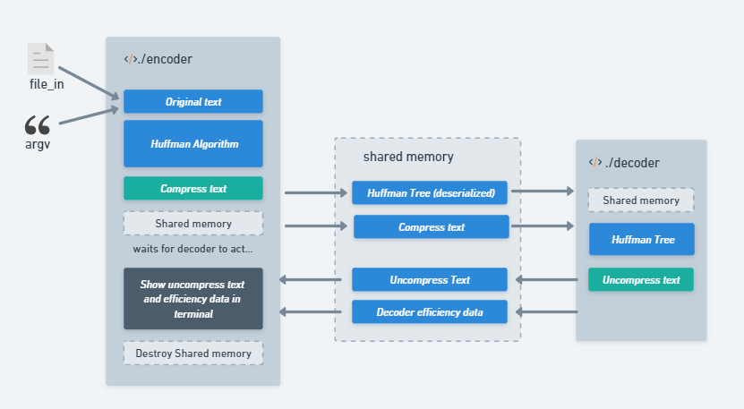

# Labs 4º Edição - Compactador de Arquivos

## Desafio e motivação

Desenvolver uma aplicação de análise e compressão de dados, baseada no algoritmo de compressão Huffman que poderá receber múltiplos dados onde, uma vez comprimidos devem ser descomprimidos e coletar informações pertinentes para a análise do processo e dados. Sendo assim deve-se criar dois programas, `encoder` e `decoder`, que devem se comunicar utilizando *shared memory operations*. O encoder receberá o dado a ser comprimido e exibirá suas informações vindas do decoder. Já, o decoder irá descomprimir o dado e irá enviá-lo ao encoder com suas informações, onde será exibido.

>Para os programadores em formação compreender e se apropriar do Algoritmo de Huffman é algo salutar, uma vez ele conta com várias estruturas de código diferentes: tabela, lista encadeada e árvore binária. É uma oportunidade muito rica para conhecer novos conceitos, aprimorar os antigos e inter relacionar todos eles. 

## Como o projeto está estruturado



*Encoder:* recebe múltiplos textos como dado e comprime-os em um único dado (usando o algoritmo de Huffman), e espera a ação do Decoder.

*Decoder:* descomprime e envia as seguintes informações ao Encoder: dado descomprimido, quantidade de bytes do dado comprimido, quantidade de bytes do dado descomprimido e o tempo da operação de descompressão.

*Encoder:* exibe no terminal as informações recebidas pelo decoder.

## Algoritmos Desenvolvidos

*Algoritmo de Huffman* - permite a compactação de dados sem perda, possibilitando a reconstrução perfeita dos dados originais. A solução de Huffman foi construir a árvore binária para gerar um novo código para cada caractere usado, garantindo uma maior otimização do espaço economizado e resultando em um *código de prefixo*, onde o código para um caractere não é prefixo de um outro.

*Operação bit a bit* - a manipulação dos bits permite passar o texto codificado para o binário.

*Memória compartilhada* - o programa 1 cria uma memória compartilhada dentro do seu espaço de endereçamento e o programa 2 pode acessar, e modificar os dados dessa memória. Assim os processos se comunicam por esta região de memória.

Para entender as etapas do projeto confira o [passo a passo](./Explanation.md).

## Instalação e execução 
Clone o repositório.

Para compilar os dois programas:
```bash
&> make
```
Compacta o texto enviado por argumento:
```bash
&> ./bin/encoder "texto para compactar" ou ./bin/encoder texto para compactar ou ./bin/encoder texto.txt
```
Descompactar o texto:
```bash
&> ./bin/decoder
```

Se necessário limpar a memória que estava compartilhando
```bash
&> ipcrm -a
```


## Possíveis utilizações

Este programa pode ser usado para codificar dados de forma a reduzir o tamanho dos dados a serem armazenados ou transmitidos. Sua utilização prática mais comum é na compressão de arquivos. Ele pode ser usado em conjunto com outros algoritmos de compressão, como LZ77 e LZ78, para obter uma compressão ainda melhor.

## Ferramentas

O [Whimsical](/whimsical.com) foi usado para montar os fluxogramas:

O [Trello](https://trello.com/pt-BR) para organizar em tarefas as etapas do projeto.

[Miro](https://miro.com/pt/) foi essencial como plataforma visual colaborativa para discutir as ideias e implementações com os colaboradores.

## Possíveis Melhorias 

- Aumentar a capacidade máxima de caracteres do texto para compressão. Hoje essa capacidade é de 1 milhão de caracteres.

- Conseguir mandar para a memória compartilhada uma string alocada com o tamanho exato a ser utilizada, e não um array de tamanho fixo.

- Colocar uma proteção no Decoder, que o faça esperar a ação do Encoder. Hoje, a execução do Decoder antes do Encoder preencher os dados na memória ocorre falha de segmentação.

- Implementar criptografia do dado comprimido, utilizando uma senha fornecida pelo usuário.

## Colaboradores

Obrigada pelo apoio e colaboração.

<a href="https://github.com/issaomori" alt="login intra">
    
</a>
<a href="https://github.com/hmigl" alt="login intra">
    
</a>
<a href="https://github.com/julianamilson" alt="login intra">
    
</a>
<a href="https://github.com/hpcavalcante" alt="login intra">
    
</a>

## Bibliografia 

https://en.wikipedia.org/wiki/Huffman_coding
https://www.ime.usp.br/~pf/analise_de_algoritmos/aulas/guloso.html
https://en.wikipedia.org/wiki/Prefix_code
https://youtube.com/playlist?list=PLqJK4Oyr5WShtxF1Ch3Vq4b1Dzzb-WxbP
https://www.youtube.com/watch?v=Yb6pc_OU5x8
https://www.youtube.com/watch?v=WgVSq-sgHOc
http://www.linhadecodigo.com.br/artigo/1494/aprendendo-a-documentar-o-seu-codigo.aspx#:~:text=Basta%20posicionar%20o%20cursor%20de,E%20a%20seguir%20teclar%20%2F%2F%2F.
https://www.youtube.com/watch?v=6g8MLNTGzpE

BACKES, André. Linguagem C: completa e descomplicada. Elsevier Brasil, 2013.\
MARTIN, Robert C. Código limpo: habilidades práticas do Agile software. Alta Books, 2019.

